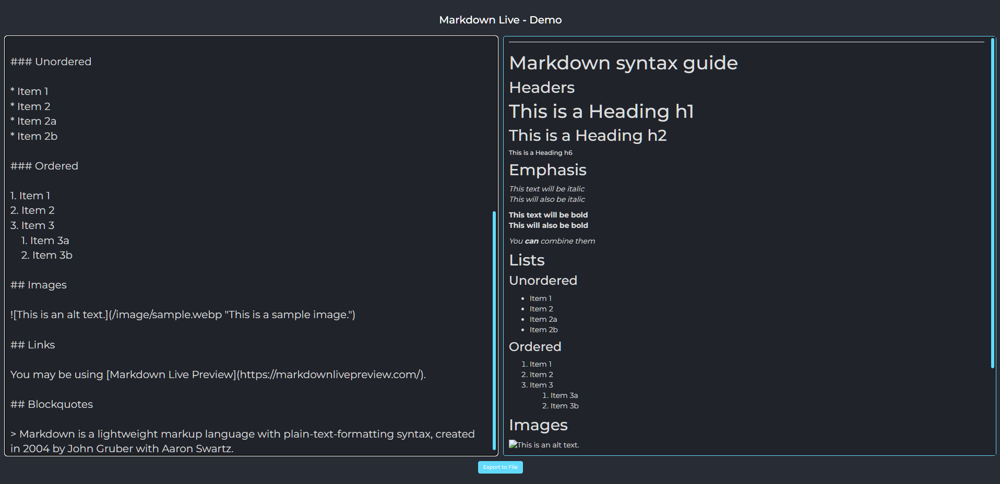
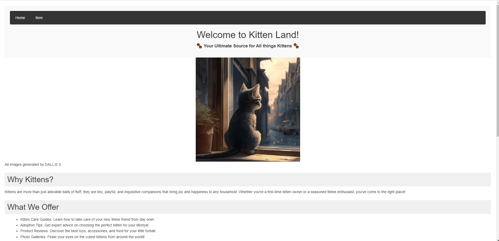
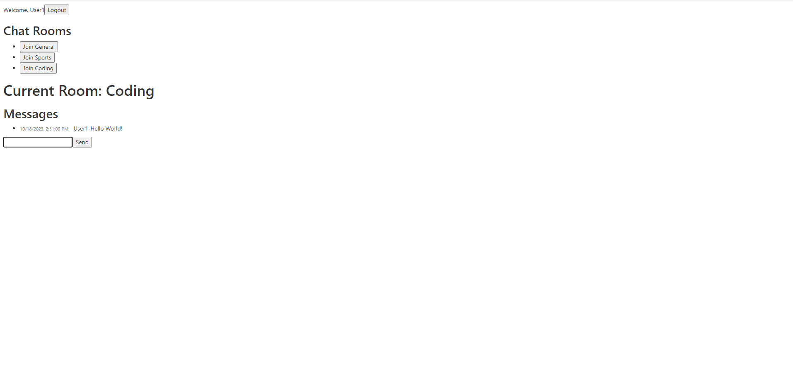
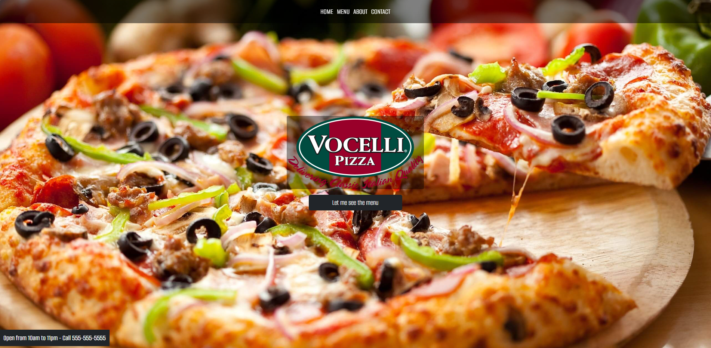

# 100Devs-MayanWolfe
 
 

    
    <h3>Wolfepack</h3>
    
<i>"I'd rather be a developer than an artist." - MayanWolfe</i>

    
A weekly Sunday coding stream from <b>MayanWolfe</b> of the 100Devs <b>Stream Team</b> for software engineers who gather to learn, share, and build full-stack web applications using modern technologies and best practices.”

 

## Projects ::
<!--                    -->
<!-- Begin Project #1   -->
<!--                    -->
<h3 href="https://www.twitch.tv/mayanwolfe" align="left">#1 MW | Markdown Demo with Live Preview</h3>

        <!-- link to project -->
    <a href='-URL TO DEMO GOES HERE-'>
    <!-- link to local image -->
        
    </a>

- [x] 100Devs - Let's Build a Markdown Preview Tool! (React, Typescript, Vite,)
  - [ ] Create a gif of Apps function
  - [ ] PLACE YOUR TODO TASKS HERE
  - [ ] PLACE YOUR TODO TASKS HERE
  - [ ] PLACE YOUR TODO TASKS HERE
  
 

    

        
        
    

    
Lorem ipsum dolor sit amet consectetur adipisicing elit. Necessitatibus,
a ipsum. Eos, in iusto? Iste dolorum, tempore ipsam voluptates ex aspernatur
voluptatum veritatis rem sequi repellat laboriosam voluptate beatae eligendi. Iure voluptates possimus tempora quibusdam, iste, similique consectetur dolor adipisci unde tempore temporibus debitis, aperiam a ut exercitationem soluta est.    
    

    <h3>Watch the video tutorial here::</h3>
    

 

<!--                    -->
<!-- Begin Project #2   -->
<!--                    -->
<h3 href="https://www.twitch.tv/mayanwolfe" align="left">#2 MW | KITTEN APP CRUD</h3>

        <!-- link to project -->
    <a href='-URL TO DEMO GOES HERE-'>
    <!-- link to local image -->
        
    </a>

- [x] 100Devs - Let's Make a Full-stack CRUD Template for ALL your future projects
  - [ ] Create a gif of Apps function
  - [ ] PLACE YOUR TODO TASKS HERE
  - [ ] PLACE YOUR TODO TASKS HERE
  - [ ] PLACE YOUR TODO TASKS HERE
  
 

    

        
        
    

    
Lorem ipsum dolor sit amet consectetur adipisicing elit. Necessitatibus,
a ipsum. Eos, in iusto? Iste dolorum, tempore ipsam voluptates ex aspernatur
voluptatum veritatis rem sequi repellat laboriosam voluptate beatae eligendi. Iure voluptates possimus tempora quibusdam, iste, similique consectetur dolor adipisci unde tempore temporibus debitis, aperiam a ut exercitationem soluta est.    
    

    <h3>Watch the video tutorial here::</h3>
    

 

<!--                    -->
<!-- Begin Project #3   -->
<!--                    -->
<h3 href="https://www.twitch.tv/mayanwolfe" align="left">#3 MW | SOCKET IO CHAT APP</h3>

        <!-- link to project -->
    <a href='-URL TO DEMO GOES HERE-'>
    <!-- link to local image -->
        
    </a>

- [x] 100Devs - Let's Make a Realtime Chat App!
  - [ ] Create a gif of Apps function
  - [ ] PLACE YOUR TODO TASKS HERE
  - [ ] PLACE YOUR TODO TASKS HERE
  - [ ] PLACE YOUR TODO TASKS HERE
  
 

    

        
        
    

    
Lorem ipsum dolor sit amet consectetur adipisicing elit. Necessitatibus,
a ipsum. Eos, in iusto? Iste dolorum, tempore ipsam voluptates ex aspernatur
voluptatum veritatis rem sequi repellat laboriosam voluptate beatae eligendi. Iure voluptates possimus tempora quibusdam, iste, similique consectetur dolor adipisci unde tempore temporibus debitis, aperiam a ut exercitationem soluta est.    
    

    <h3>Watch the video tutorial here::</h3>
    

 

<!--                    -->
<!-- Begin Project #4   -->
<!--                    -->
<h3 href="https://www.twitch.tv/mayanwolfe" align="left">#4 MW | RESTUARANT WEBSITE</h3>

        <!-- link to project -->
    <a href='-URL TO DEMO GOES HERE-'>
    <!-- link to local image -->
        
    </a>

- [x] 100Devs - Let's Build a Restaurant Website! (Vanilla)
  - [ ] Create a gif of Apps function
  - [ ] PLACE YOUR TODO TASKS HERE
  - [ ] PLACE YOUR TODO TASKS HERE
  - [ ] PLACE YOUR TODO TASKS HERE
  
 

    

        
        
    

    
The Restaurant Template is a simple yet elegant website built using HTML, CSS, and JavaScript. It's designed to provide a seamless user experience for restaurant owners looking to showcase their menu and services. The project consists of three main files: index.html, styles.css, and script.js.

    <h3>Watch the video tutorial here::</h3>
    

 

