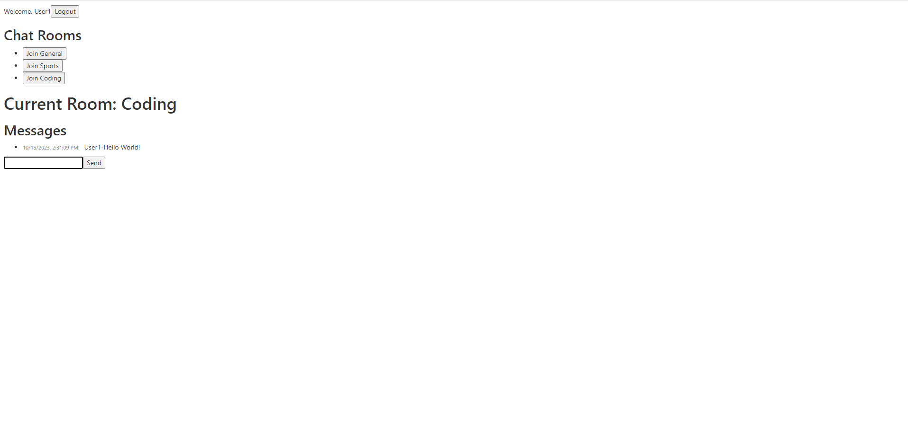

# FullStack Chat App Socket/IO

<!-- link to project -->
    <a href='-URL TO DEMO GOES HERE-'>
    <!-- link to local image -->
        
    </a>

**Link to project:** http://recruiters-love-seeing-live-demos.com/

 

    
    <h3>Wolfepack</h3>
    
<i>"I'd rather be a developer than an artist." - MayanWolfe</i>

    
A weekly Sunday coding stream from <b>MayanWolfe</b> of the 100Devs <b>Stream Team</b> for software engineers who gather to learn, share, and build full-stack web applications using modern technologies and best practices.”

  <h3>100Devs - Let's Make a Realtime Chat App!::</h3>
   
    &nbsp
    

 

## Technologies Used:

Here's where you can go to town on how you actually built this thing. Write as much as you can here, it's totally fine if it's not too much just make sure you write _something_. If you don't have too much experience on your resume working on the front end that's totally fine. This is where you can really show off your passion and make up for that ten fold.

 

  

## How was this Built

- **index.html**: This is the backbone of the website, containing the structure and content. It features a Lorem ipsum dolor sit amet consectetur adipisicing elit. Sed non nemo cum a nulla magni libero odio porro culpa harum.

- **styles.css**: This file holds all the custom styles. It uses Lorem ipsum dolor sit amet consectetur adipisicing elit. Sed non nemo cum a nulla magni libero odio porro culpa harum.

- **script.js**: This JavaScript file adds interactivity to the Lorem ipsum dolor sit amet consectetur adipisicing elit. Sed non nemo cum a nulla magni libero odio porro culpa harum.

- **script.js**: This JavaScript file adds interactivity to the Lorem ipsum dolor sit amet consectetur adipisicing elit. Sed non nemo cum a nulla magni libero odio porro culpa harum.