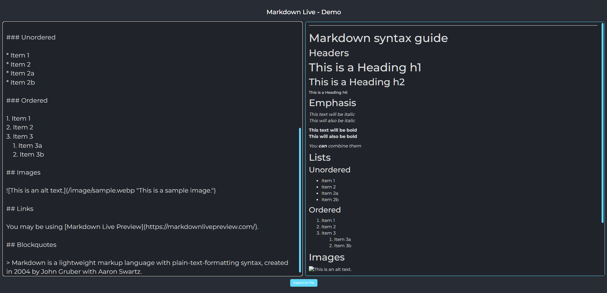

# Markdown Demo with Live Preview
<div align="center" >
<!-- link to project -->
    <a href='-URL TO DEMO GOES HERE-'>
    <!-- link to local image -->
        
    </a>

  **Link to project:** http://recruiters-love-seeing-live-demos.com/

  <p>
  <a href="https://github.com/rayanthoney/mw_fullstack-CRUD-template" target="_blank">
  
  </a>&nbsp
  <a href="-URL DEMO GOES HERE-" target="_blank">
  
  </a>
  </p>
  </div>

  <br>

  <div align="center">
      
      <h3>Wolfepack</h3>
      <p><i>"I'd rather be a developer than an artist." - MayanWolfe</i></p>
      <p>A weekly Sunday coding stream from <b>MayanWolfe</b> of the 100Devs <b>Stream Team</b> for software engineers who gather to learn, share, and build full-stack web applications using modern technologies and best practices.”</p>

  <h3>100Devs - Let's Build a Markdown Preview Tool! (React, Typescript, Vite::</h3>
  <br>
    <a href="https://www.youtube.com/@MayanwolfeStreams" target="_blank">
      
    </a>&nbsp
    <a href="https://www.twitch.tv/videos/1969672680" target="_blank">
      
    </a>
</div>

<br>
<br>

## Technologies Used:

This tool allows the user to enter plain text in a box with Markdown notation, and see an immediate live preview of the result to the right.

<br>

<p align="center">
  <a href="https://skillicons.dev">
    
  </a>
</p>

## How was this Built

### Markdown Preview Tool

>This project was built with ::
- **HTML** 
- **CSS** 
- **JS** 
- **Vite**
- **React** 
- **TypeScript**  
- **NodeJS**  
  
>It uses the 
- **Marked** 
  
>and 
- **DOMPurify** 
  
>Packages to process the 
- **Markdown** 
  
>and sanitize it again 
- **Cross-Site Scripting (XSS)**.

## Getting Started

 - Clone the repo into VSCode or your preferred editor
 - Open a terminal and CD into the project
  - Enter "npm install" to install the dependencies


<br>

<!-- # React + TypeScript + Vite

This template provides a minimal setup to get React working in Vite with HMR and some ESLint rules.

Currently, two official plugins are available:

- [@vitejs/plugin-react](https://github.com/vitejs/vite-plugin-react/blob/main/packages/plugin-react/README.md) uses [Babel](https://babeljs.io/) for Fast Refresh
- [@vitejs/plugin-react-swc](https://github.com/vitejs/vite-plugin-react-swc) uses [SWC](https://swc.rs/) for Fast Refresh

## Expanding the ESLint configuration

If you are developing a production application, we recommend updating the configuration to enable type aware lint rules:

- Configure the top-level `parserOptions` property like this:

```js
   parserOptions: {
    ecmaVersion: 'latest',
    sourceType: 'module',
    project: ['./tsconfig.json', './tsconfig.node.json'],
    tsconfigRootDir: __dirname,
   },
```

- Replace `plugin:@typescript-eslint/recommended` to `plugin:@typescript-eslint/recommended-type-checked` or `plugin:@typescript-eslint/strict-type-checked`
- Optionally add `plugin:@typescript-eslint/stylistic-type-checked`
- Install [eslint-plugin-react](https://github.com/jsx-eslint/eslint-plugin-react) and add `plugin:react/recommended` & `plugin:react/jsx-runtime` to the `extends` list
---
# Markdown syntax guide

## Headers

# This is a Heading h1
## This is a Heading h2
###### This is a Heading h6

## Emphasis

*This text will be italic*  
_This will also be italic_

**This text will be bold**  
__This will also be bold__

_You **can** combine them_

## Lists

### Unordered

* Item 1
* Item 2
* Item 2a
* Item 2b

### Ordered

1. Item 1
2. Item 2
3. Item 3
    1. Item 3a
    2. Item 3b

## Images


## Links

You may be using [Markdown Live Preview](https://markdownlivepreview.com/).

## Blockquotes

> Markdown is a lightweight markup language with plain-text-formatting syntax, created in 2004 by John Gruber with Aaron Swartz. -->