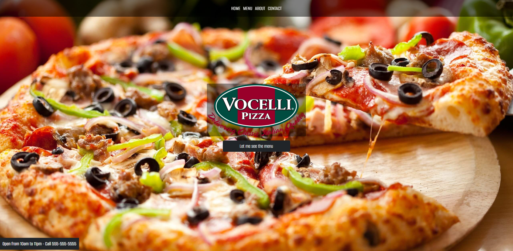

# Fullstack CRUD Template EJS MongoDB

<!-- link to project -->
    <a href='-URL TO DEMO GOES HERE-'>
    <!-- link to local image -->
        
    </a>

**Link to project:** http://recruiters-love-seeing-live-demos.com/

 

    
    <h3>Wolfepack</h3>
    
<i>"I'd rather be a developer than an artist." - MayanWolfe</i>

    
A weekly Sunday coding stream from <b>MayanWolfe</b> of the 100Devs <b>Stream Team</b> for software engineers who gather to learn, share, and build full-stack web applications using modern technologies and best practices.”

  <h3>100Devs - Let's Build a Restaurant Website!::</h3>
   
    &nbsp
    

 

## Technologies Used:

Readme written by: [graylan0](https://github.com/graylan0)

The Restaurant Template is a simple yet elegant website built using HTML, CSS, and JavaScript. It's designed to provide a seamless user experience for restaurant owners looking to showcase their menu and services. The project consists of three main files: `index.html`, `styles.css`, and `script.js`.

 

  

## How was this Built

- **index.html**: This is the backbone of the website, containing the structure and content. It features a fixed-top navigation bar, a captivating header with a call-to-action button, and a menu section with various food items.

- **styles.css**: This file holds all the custom styles. It uses the "Alumni Sans" Google Font and Bootstrap for styling. The CSS is organized into sections for easy navigation, including styles for the navbar, header, and menu items. Special hover effects and responsive design elements are also included.

- **script.js**: This JavaScript file adds interactivity to the menu section. It employs a tabbed interface allowing users to switch between different categories like Pizza, Pasta, and Starters. The script ensures that the first tab is auto-selected upon page load.

